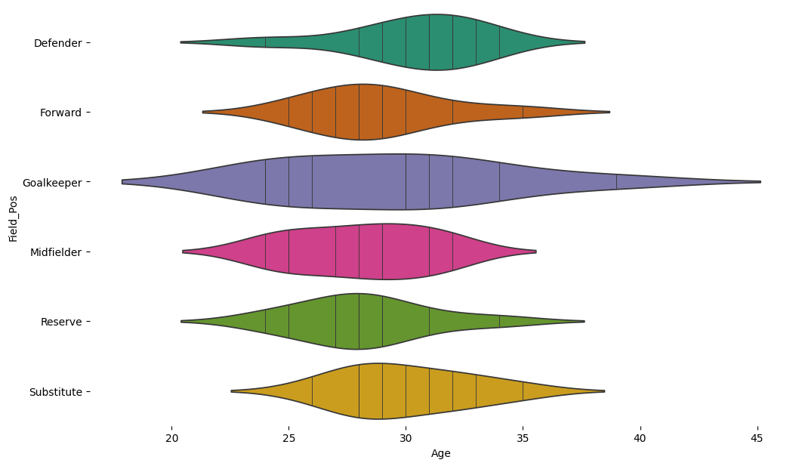
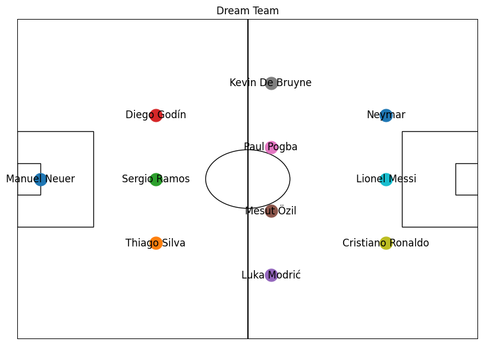
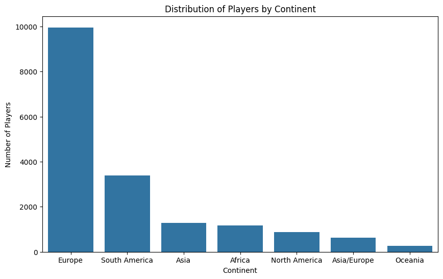

# Sport Bet Project
Project Documentation for Hoang Le Duc and David Heller
A Data Analytics project using a Professional Soccer Database with 17k professional Soccer Player along with adjusted 2024 salary information from Web Scrapping of Capology website in order to provide insights into players' statistics' correlation with their payment. This project also aims to assemble the best overall value soccer team and the best rating team within a given budget using linear programming.

## Files

### `best_overall_val_team.csv`
This file contains the details of the best overall value team within the specified budget. The team is selected based on the highest overall value, which is calculated as the product of rating per dollar and the player's rating.
### `best_rating_team.csv`
This file contains the details of the best rating team within the specified budget. The team is selected based on the highest overall rating while making sure that the total sum cost doesn't exceed the budget.

**Columns:**
- `Field_Pos`: The position of the player on the field.
- `Rating`: The player's rating.
- `adjusted_money`: The cost of the player.
- `Overall_value`: The overall value calculated for the player.

**Index:**
- Index of these table are the name of professional soccer athletes.

Tableau link 
Link to presentation

## Dataset

We have included data from the [Soccer Players Statistics](https://www.kaggle.com/datasets/antoinekrajnc/soccer-players-statistics/data) dataset on Kaggle for additional analysis and features. Other information are acquired from [Capology](https://www.capology.com/) website 

**Presentation**
[Google Slide](https://trello.com/invite/b/6G76kTW7/ATTI1eefd2197e87bf394d3d2491a48118ed841D6ABD/sport-betting-project)
